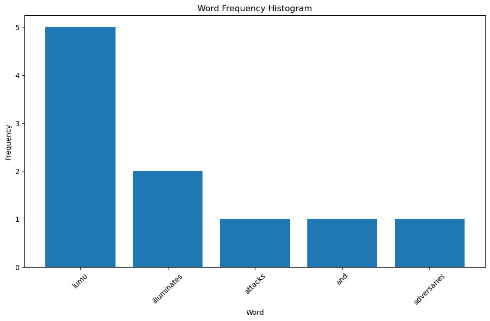

# Software Developer Engineer in Test - Test Automation Engineer


### 1 - AUTOMATED TEST SUITE
Using your preferred language/framework, create a test suite that
automatically validates that [WordCounter](https://wordcounter.net/) correctly displays:
- number of words
- number of characters
- The 3 most repeated words with the number of repetitions (Keyword
Density section)

You're free to create as many scenarios as you think are necessary to cover
those three points. It's mandatory to generate a summary report showing how
many scenarios were executed, how many passed, and how many failed with it's
error description.
Requirements

- You don't need to modify any settings in the website, always use the
default settings.
- Ask as many questions you have in order to clarify the scope of your
tests. 

Feel free to contact us or be sure to detail any assumption you
made. (Limit your questions to a single mail please)
For 1st and 4rd points:

- Upload your project to a GitHub repo and share it with us. 
- Provide detailed instructions on how to run your project (preferably also in the repo).

#### 1.1 - AUTOMATED TEST SUITE - SOLUTION

Lumu Technologies is a project that developed the technical test presented in the previous paragraph.

In order to use best practices, the screemplay pattern was used, creating a single test scenario that encompasses all the test cases presented in the requirements.


#### 1.2 - INSTALLATION

The development should be focused on the use of **Linux** OS or **Unix** based systems, to make the installation of the dependencies effective and ensure the operation of the project in any **development**, **testing**, and **production** environment.

For **Windows** operating systems based on version **11**, the installation of the project is performed with these steps:

1. First install [Java 17](https://www.oracle.com/java/technologies/javase/jdk17-archive-downloads.html) as the base programming language of this repository, install [Maven 3.8.6](https://maven.apache.org/download.cgi) and create the environment variables for each of the above tools.
   To test the installation you should run the following commands in your preferred command terminal.
```sh
$ java --version
$ mvn --version
```

2. As this is an automation backend project developed with serenity bdd framework [Serenity](https://serenity-bdd.github.io/docs/tutorials/first_test), it is not necessary to install any extra tool, however, you should review the documentation to understand how it works.


## How to run the tests?

Following these steps, we can perform the execution of the test suite or a specific feature:
```sh
$ mvn clean test verify
$ mvn clean verify -Dcucumber.filter.tags=@nombreTag
```

The test results will be recorded in the **target/site/serenity/index.html** directory.

### 2 - FAILURE REPORT
You can not usually build automated testing for something that you have not done good manual testing before, so it is vital that our test engineers are able to transmit ideas, listen, and report defects/failures in a clear way.
Write a short report on any findings that you may consider a defect or worth of improvement for [WordCounter](https://wordcounter.net/).

#### 2.1 - FAILURE REPORT - SOLUTION
- Within the application, there is a marked inconsistency in the choice of colors, resulting in an unpleasant user experience. For example, a light shade of blue is used in the navigation bar, while the action buttons have a darker shade of blue.
Recommendation: To maintain a visual appearance, it is suggested to harmonize all interface elements with a consistent color palette.


- When accessing the application from mobile devices or smaller screens, it is detected that some elements experience overflow or overlapping, which has a negative impact on usability and readability.
Recommendation: In order to ensure an optimal experience on all screens, it is necessary to conduct extensive testing on mobile devices and effectively address responsive design issues.


- The application does not meet appropriate accessibility standards as it does not provide adequate labels for essential elements such as images and forms, which excludes users with visual impairments.
Recommendation: To ensure universal accessibility, a design system is encouraged.


- The implementation of "alt" tags for images and the inclusion of "aria" attributes in interactive elements are not evident.
Recommendation: It is suggested the implementation of these aforementioned tags, on the other hand, along with the previous task, attributes can be implemented to identify elements within the page and to identify the elements that are not included in the design.


- Application pages have been identified as having long loading times.
Recommendation: Establish response times for each of the services and the elements displayed on the page since there are studies that show that if an app does not respond in 3 seconds or less, it leaves and looks for another page that offers a service. similar

### 3 - UX MATTERS
Usually our work as testers in a product/project starts from the design phase,
in that time we already can make comments and suggestions that allows the
Design team to make some improvements in order to have a clean final product
that matches with the client's expectations.
In this test you may search for issues in user interfaces of a public and well
known web page/application (ex. Search forms, Business flows, Payment forms).
You may build a report with 3 UX issues, give us a clear explanation about
what’s wrong and how we can replicate it.

#### 3.1 - UX MATTERS - SOLUTION
After making several queries on the Internet, it can be identified that WordCounter is a tool that is used to count words and characters in a text entered by the user, after this research we found the following points that we suggest to improve.


- The user interface is confusing, and new users may find it difficult to understand how to use the existing tools and functionalities.
We can replicate this opportunity for improvement when entering the tool for the first time since there is no user guide or manual that we can follow, which can generate a fairly high learning curve and part of the users could look for other tools that do the same and would generate a loss of users.
Suggestion: Adopt a design system such as Google, Jira, or any other to improve the experience and satisfaction of our users.


- When entering the web page, select the browser development tools with the keys **ctrl + ship + I** and go to the mobile part to validate the responsiveness of the site we can observe that the image is distorted and the elements do not look attractive.
This can be uncomfortable for most of the users since the new technological trends show that each of us usually enters any site using our mobile devices.
Suggestion: Along with the suggestion of the previous point, you can adapt the site to certain screen sizes (the most used for mobile, Tablet, and computer) this will allow an increase in user traffic and thus we can retain them.


- When entering text into the tool, there are limitations in the text analysis functionalities.
Suggestion: Add additional tools that allow the identification of keywords, and detection of grammatical errors in different languages, and enable rest services to integrate with other tools with the phone keyboard, computer, or other code editing tool.


### 4 - WORD FREQUENCY COUNTER
Knowing how often a word appears in a sentence or block of text is helpful for
several types of word analysis.
Using your preferred language/framework, create your own algorithm that reads
a text file and counts the frequency of words in the given text. Then it
counts words and characters, and also constructs a histogram displaying the
words and the frequency.
Example Output.
Given a file with the text below
lumu lumu lumu lumu lumu illuminates illuminates attacks and adversaries

#### 4.1 - WORD FREQUENCY COUNTER - SOLUTION

To give solution to the previous point a book with **.ipynb** extension was created, if you want to run it inside your environment you must create a file with the above mentioned extension and run, using the jupyter notebook environment.
The code is shown below, which is stored in the folder **Word Frequency Histogram** together with the **.txt** file used for the exercise.

```python
import re
from collections import Counter
import matplotlib.pyplot as plt
```

```python
class ReadFile:
    
    def read(self) -> str:
        with open('LumuTechnologies.txt', 'r') as file:
            return file.read()
```

```python
data = ReadFile()
data.read()
```

```python
class CounterWordCharacter:
    data = ReadFile()
    top_n = 10

    def token(self):
        return re.findall(r'\b\w+\b', self.data.read().lower())

    def word_frequency(self) -> Counter[Any]:
        return Counter(self.token())

    def words(self):
        return len(self.token())

    def characters(self):
        return len(self.data.read())

    def common_words(self):
        return self.word_frequency().most_common(self.top_n)
```

```python
class CreateHistogram:

    word = CounterWordCharacter()

    def histogram(self):
        plt.figure(figsize=(10, 6))
        plt.xlabel('Word')
        plt.ylabel('Frequency ')
        plt.title('Word Frequency Histogram')
        plt.xticks(rotation=45)
        plt.tight_layout()
        plt.bar(*zip(*self.word.common_words()))
        plt.show()
```

```python
word = CounterWordCharacter()
print(word.words())
print(word.characters())
print(word.common_words())
print(word.token())
print(word.word_frequency())
print(word.common_words())
histogram = CreateHistogram()
histogram.histogram()
```

Below is the result when executing the code in a python environment.

